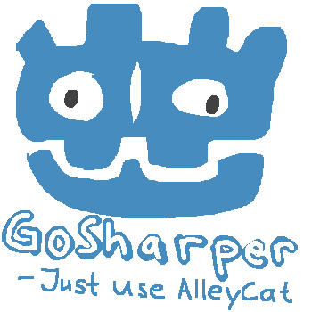

<div align="center">
    
</div>

# GoSharper
Useful classes, methods and style guide (?) for Godot C# that I felt were missing.

- [GoSharper](#gosharper)
  * [Features](#features)
  * [Usage](#usage)
    + [Classes](#classes)
      - [NodeService](#nodeservice)
      - [ShapeService](#shapeservice)
  * [Style Guide & Structure](#style-guide---structure)

<small><i><a href='http://ecotrust-canada.github.io/markdown-toc/'>Table of contents generated with markdown-toc</a></i></small>

## Features
* Typed node features
* Typed scene handler
* Shape creator for shapes like a hexagon ...
* ObjectPools
ICreatable (factory method)

## Usage
Never mind, just use [AlleyCat](https://github.com/mysticfall/AlleyCat) :slightly_smiling_face:

### Classes

#### NodeService
Checks if a signal is connected, and connects only if it is not already connected.
```csharp
void TryConnect(String signal, Object target, String _);
```

lorem ipsum
```csharp
IList<T> GetChildrenOfType<T>(Node node)
```

#### ShapeService
Returns a array of 6 points representing a hexagon with the center being ```(0, 0)```.
```csharp
Vector2[] CreateHexagon(float sideLength)
```

## Style Guide & Structure
todo
